# 知识点总结

## 特征值和特征向量

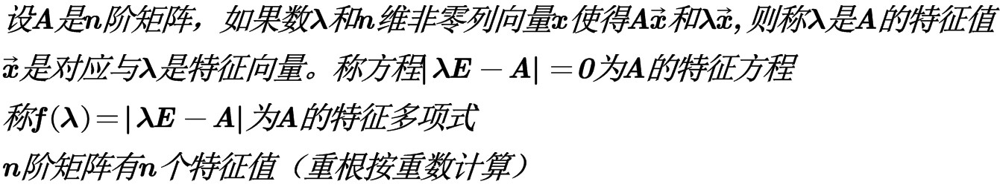

## 计算特征值与特征向量的步骤

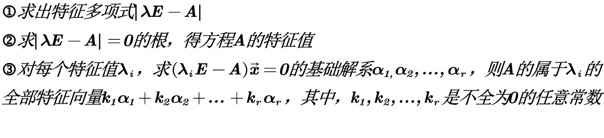

## 特征值和特征向量的性质

$若A与B相似     \\A-kE=B-kE$

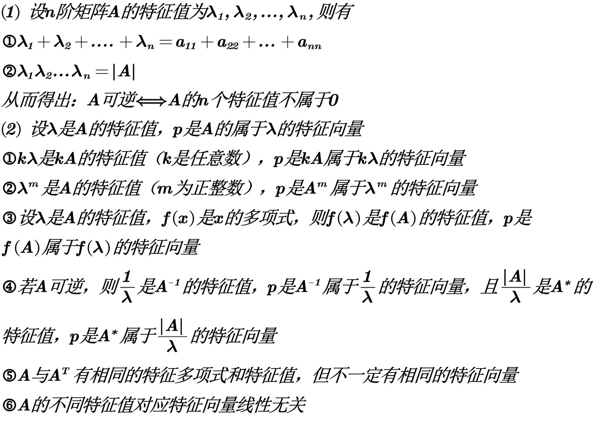

## 相似矩阵的概念

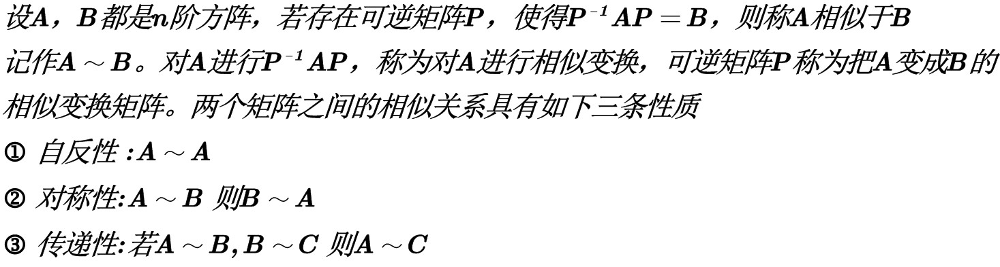

## 相似矩阵的性质

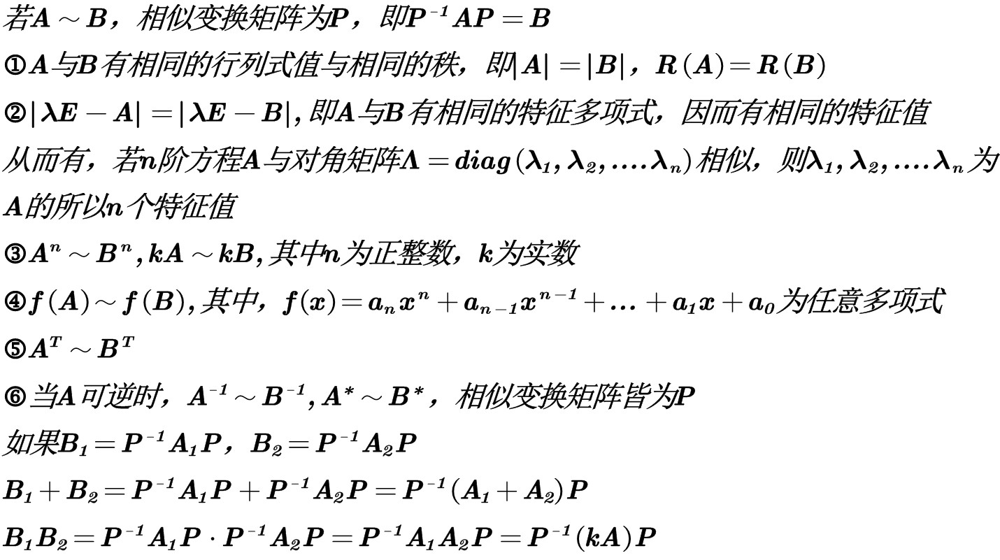

## 矩阵的对角化

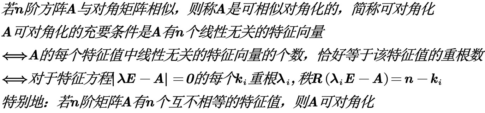

## 相似对角化的步骤

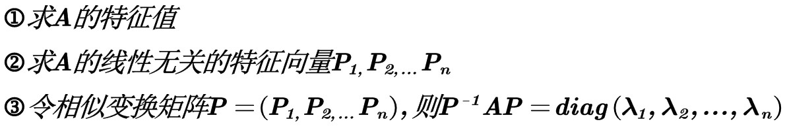

## 实对称矩阵的性质

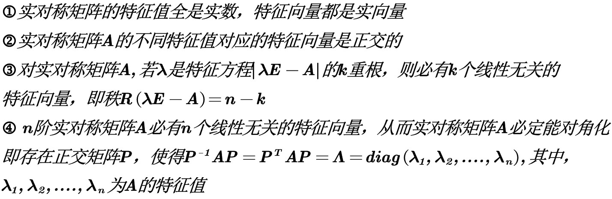

## 求使A对角化的正交矩阵P的步骤

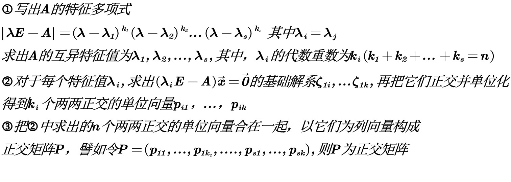

## 二次型及其标准型

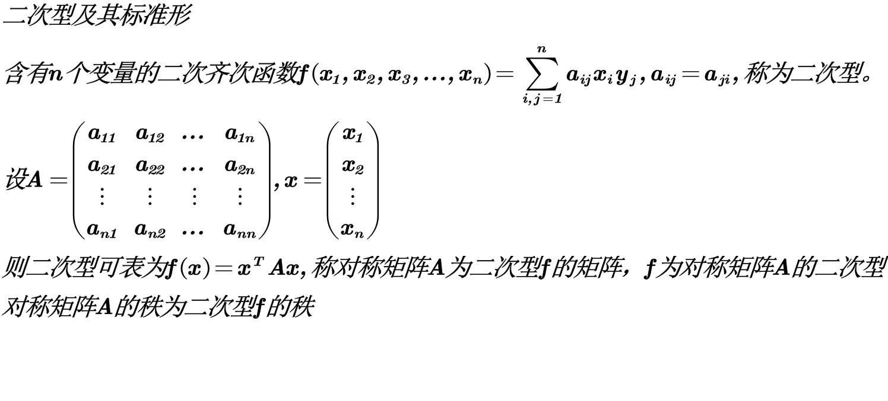

## 合同变换矩阵

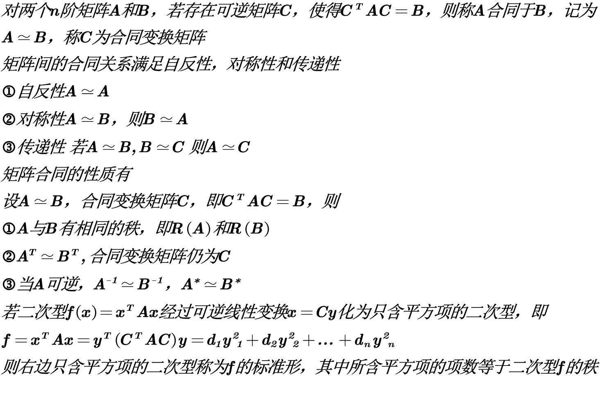

## 惯性定理

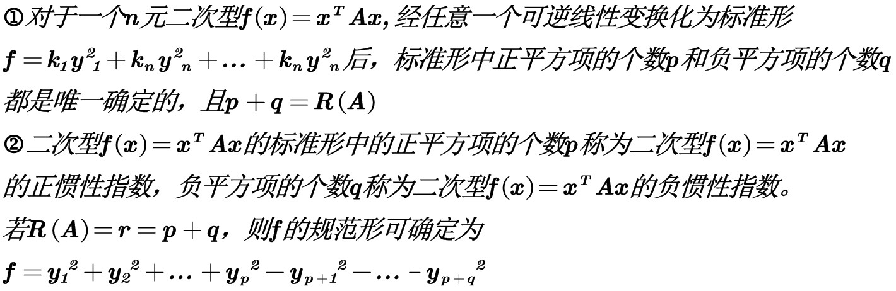

## 正交变换法

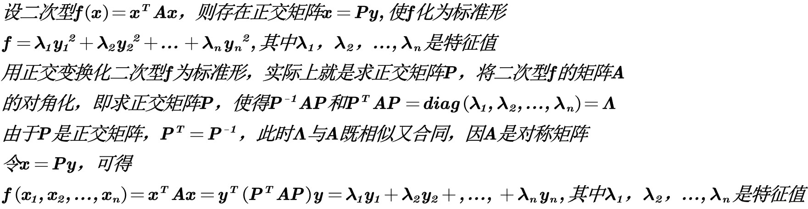

## 配方法

