# 第1题

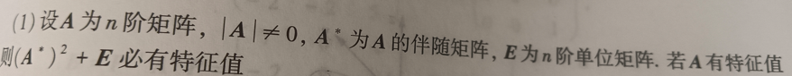
$$
\boldsymbol{A}^*\boldsymbol{的特征值}\frac{|\boldsymbol{A}|}{\boldsymbol{\lambda }}
\\
\left( \boldsymbol{A}^* \right) ^{\boldsymbol{2}}\boldsymbol{的特征值}\frac{|\boldsymbol{A}|^{\boldsymbol{2}}}{\boldsymbol{\lambda }^{\boldsymbol{2}}}
\\
\left( \boldsymbol{A}^* \right) ^{\boldsymbol{2}}+\boldsymbol{E的特征值}\frac{|\boldsymbol{A}|^{\boldsymbol{2}}}{\boldsymbol{\lambda }^{\boldsymbol{2}}}+\boldsymbol{1}
$$

# 第2题

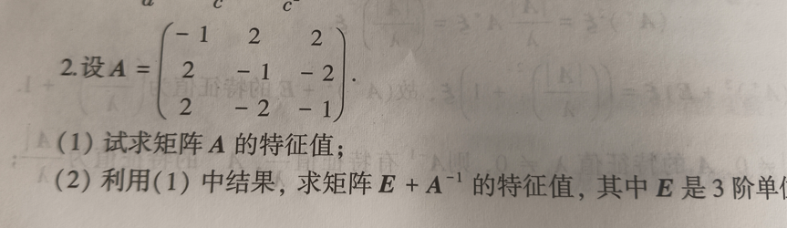

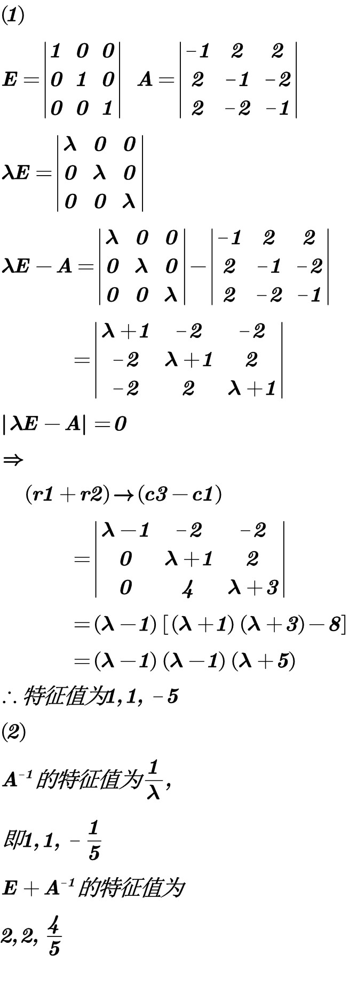

# 第3题

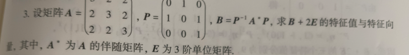

## 答案1

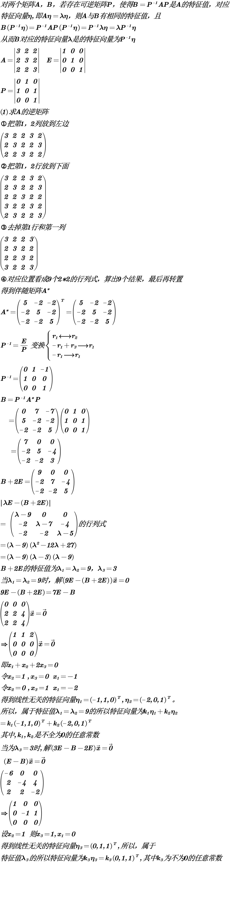

## 答案2

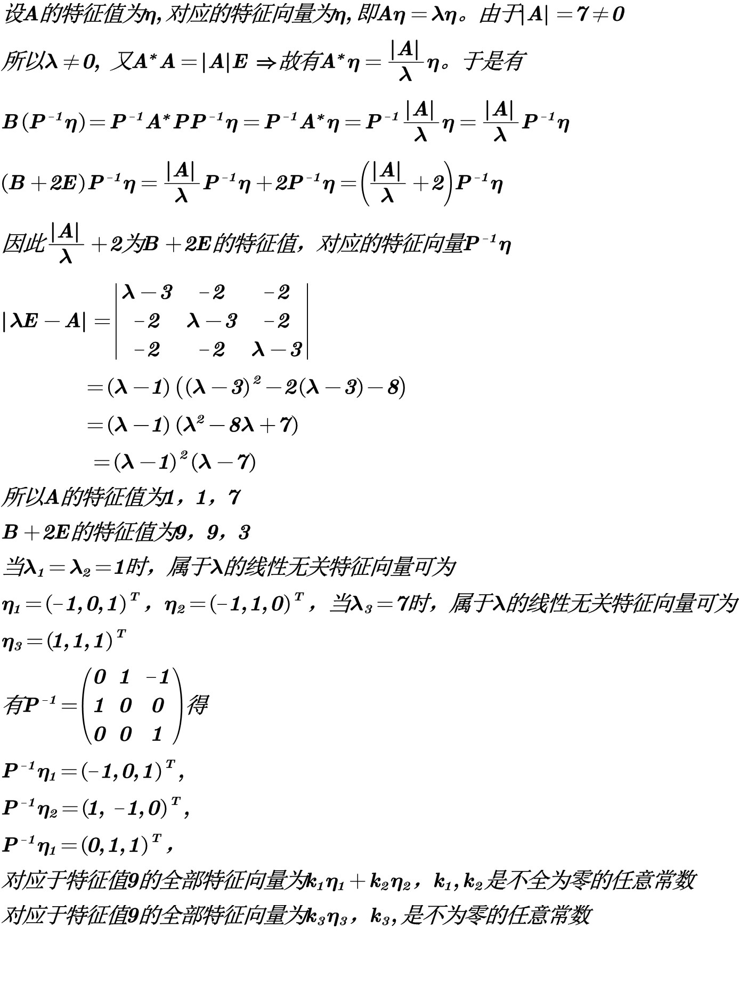

# 第4题

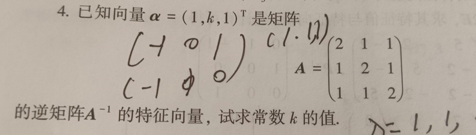

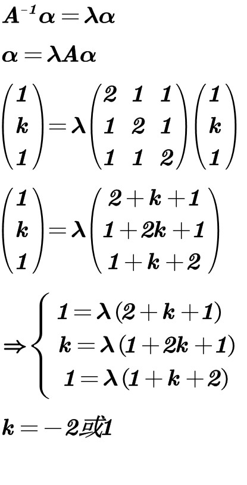

# 第5题

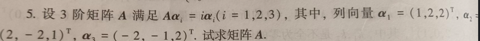

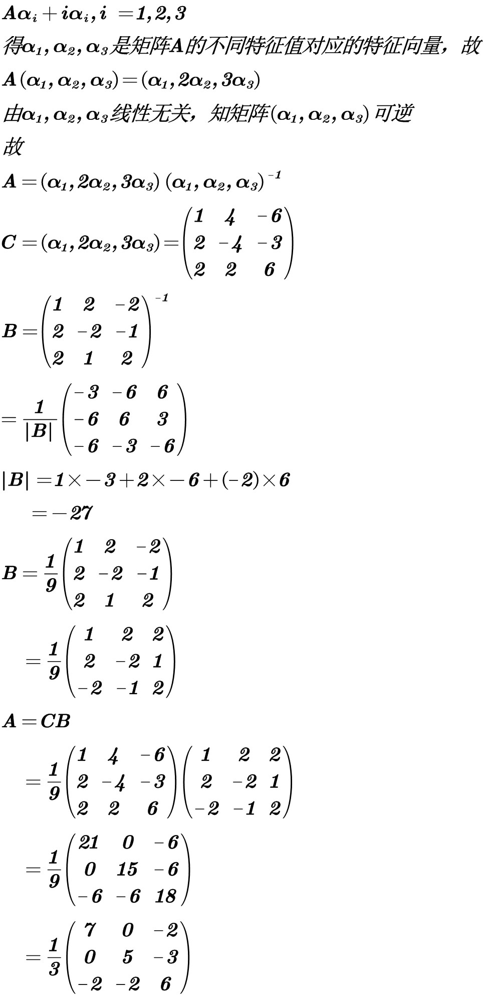

# 第6题

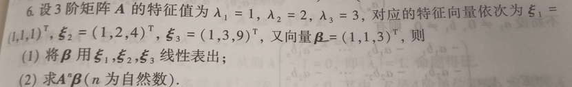

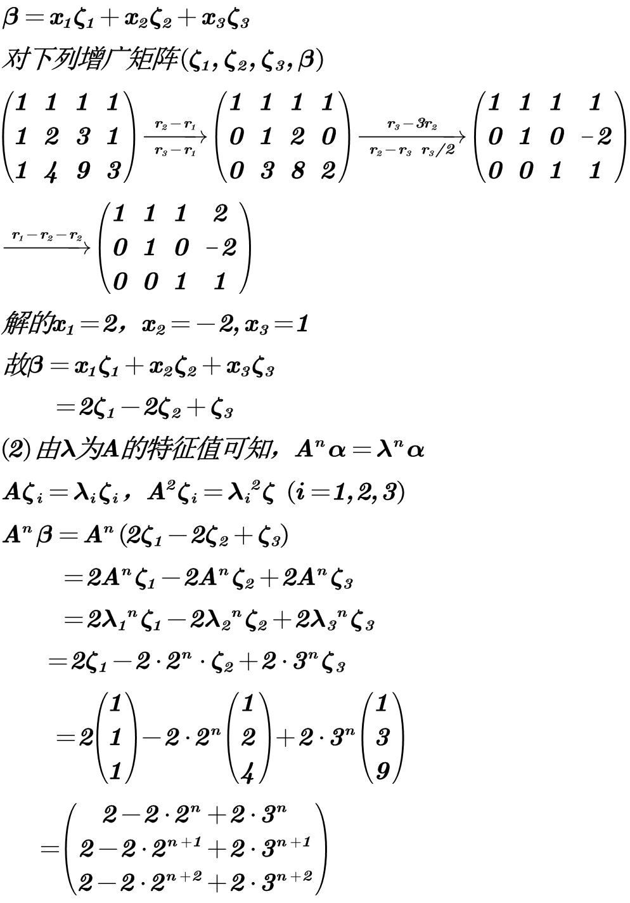

# 第7题

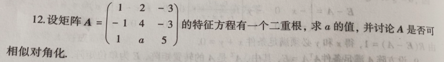

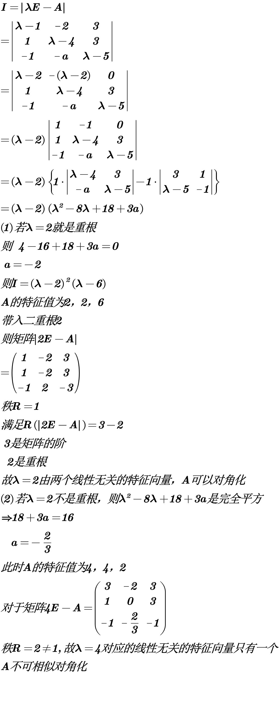

# 第8题

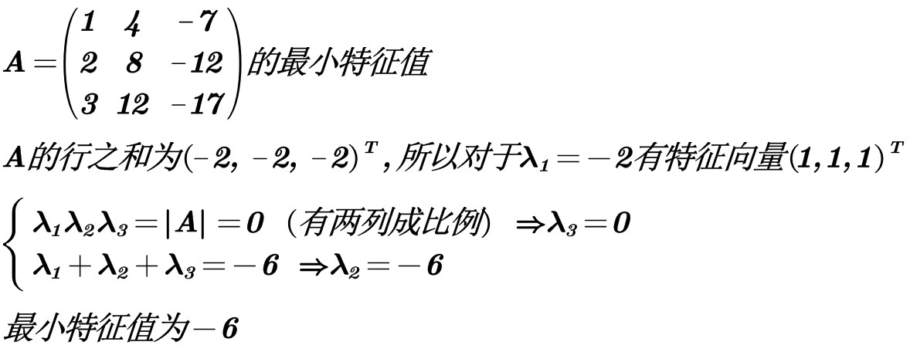

# 第9题

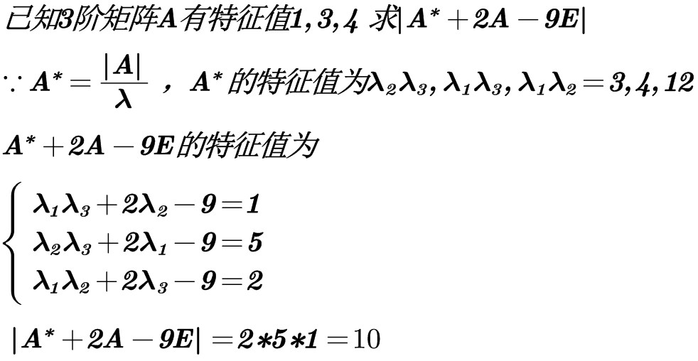
