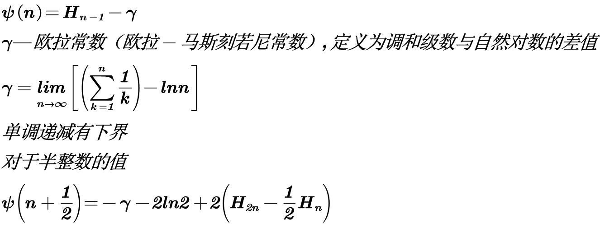
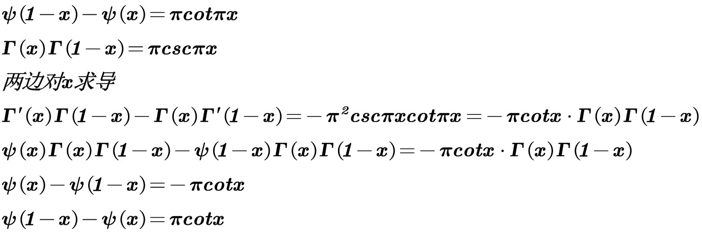
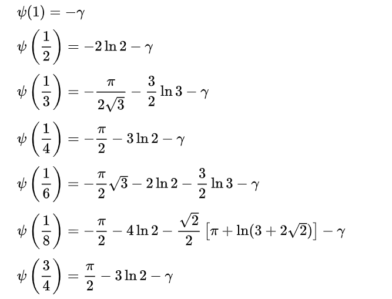
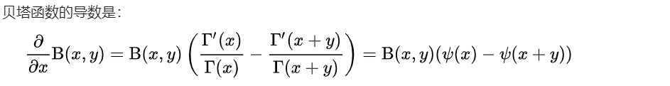

# 双伽马函数Digamma

## 网址

https://zh.wikipedia.org/wiki/%E5%8F%8C%E4%BC%BD%E7%8E%9B%E5%87%BD%E6%95%B0

## 定义

$$
\boldsymbol{双伽马函数是伽马函数的对数导数}
\\
\boldsymbol{\psi }\left( \boldsymbol{x} \right) =\frac{\boldsymbol{dln\varGamma }\left( \boldsymbol{x} \right)}{\boldsymbol{dx}}=\frac{\boldsymbol{\varGamma }^{\prime}\left( \boldsymbol{x} \right)}{\boldsymbol{\varGamma }\left( \boldsymbol{x} \right)}
$$

## 与调和数的关系

## 反射公式

## 递推关系

$$
\boldsymbol{\psi }\left( \boldsymbol{x}+\boldsymbol{1} \right) =\boldsymbol{\psi }\left( \boldsymbol{x} \right) +\frac{\boldsymbol{1}}{\boldsymbol{x}}
$$

## 特殊值

## 与贝塔函数的关系

